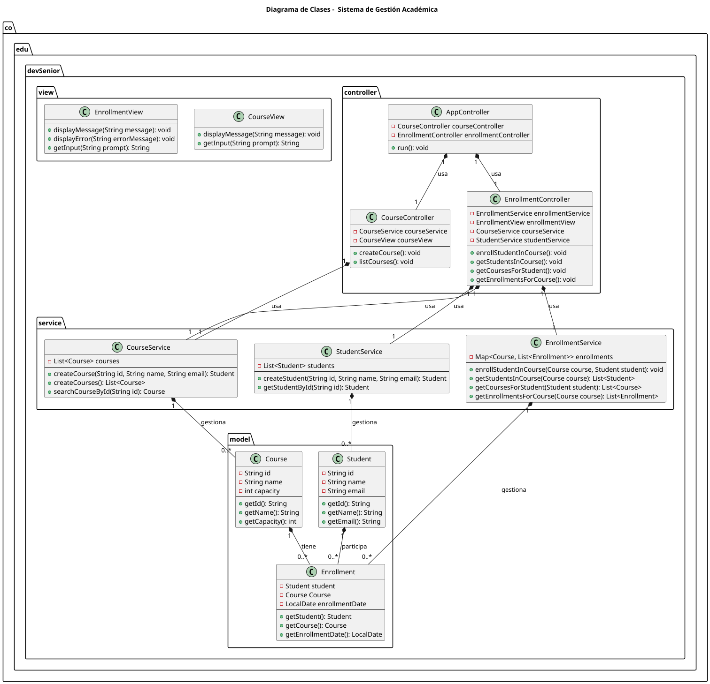

# Exceptions and Logs

Educational project in Java DevSenior module 3, aimed at managing courses, students, and enrollments, with a focus on **exception handling**, **loggers** and **unit testing**.

## Tabla of Contens

1. [Description](#description)
2. [UML Diagram](#uml-diagram)
3. [Technologies](#technologias)
4. [Getting Started](#getting-started)
5. [Project Structure](#project structure)
6. [Custom Exceptions](#custom-exceptions)
7. [Logging](#logging)
8. [Unit Testing](#unit-testing)

## Description

This project demonstrates the use Java and Maven to build an academic management system, highlighitng the implementation of custom exceptions, logging with Log4j2, and unit testing with JUnit.

## UML Diagrams



## Technologíes

- Java 21
- Maven
- Log4j2
- JUnit 5

## Getting Started

1. Clone the repository:
    ```bash
    git clone https://github.com/DJAngel973/Project-3
    cd exceptions-and-logs
    ```

2. Compile the project:
    ```bash
    mvn clean install
    ```

3. Run the application:
    ```bash
    mvn exec:java -Dexec.mainClass="co.edu.devSenior.App"
    ```

4. Run the unit tests:
    ```bash
    mvn test
    ```

## Project Structure

```plaintext
src/
├── main/
│   ├── java/co/edu/devSenior/
│   │   ├── App.java
│   │   ├── controller/
│   │   │   ├── AppController.java
│   │   │   ├── CourseController.java
│   │   │   └── EnrollmentController.java
│   │   ├── exception/
│   │   │   ├── StudentAlreadyExistsException.java
│   │   │   └── StudentNotFoundException.java
│   │   ├── model/
│   │   │   ├── Course.java
│   │   │   ├── Enrollment.java
│   │   │   └── Student.java
│   │   ├── service/
│   │   │   ├── CourseService.java
│   │   │   ├── EnrollmentService.java
│   │   │   └── StudentService.java
│   │   └── view/
│   │       ├── CourseView.java
│   │       └── EnrollmentView.java
│   └── resources/
│       └── log4j2.xml
├── test/
│   └── java/co/edu/devSenior/
│       ├── CourseServiceTest.java
│       └── StudentServiceTest.java
└── uml/
    ├── Enrollment.plantuml
    └── EnrollmentUML.png
```

## 6. Custom Exceptions

- `StudentNotFoundException`
- `StudentAlreadyExistsException`

These exceptions allow for clear and specific error handling related to students.

## 7. Logging

The log configuration is located in `src/main/resources/log4j2.xml` and uses Log4j2 to record important events and errors during the application's execution.

## 8. Unit Testing

Unit tests are implemented with JUnit 5..
Example: `CourseServiceTest.java` en `src/test/java/co/edu/devSenior/`.

To run the tests:
```bash
    mvn test
```
